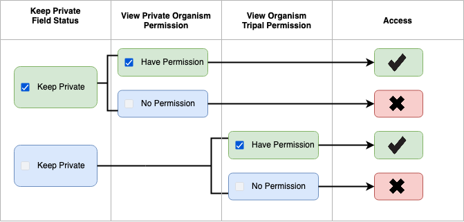
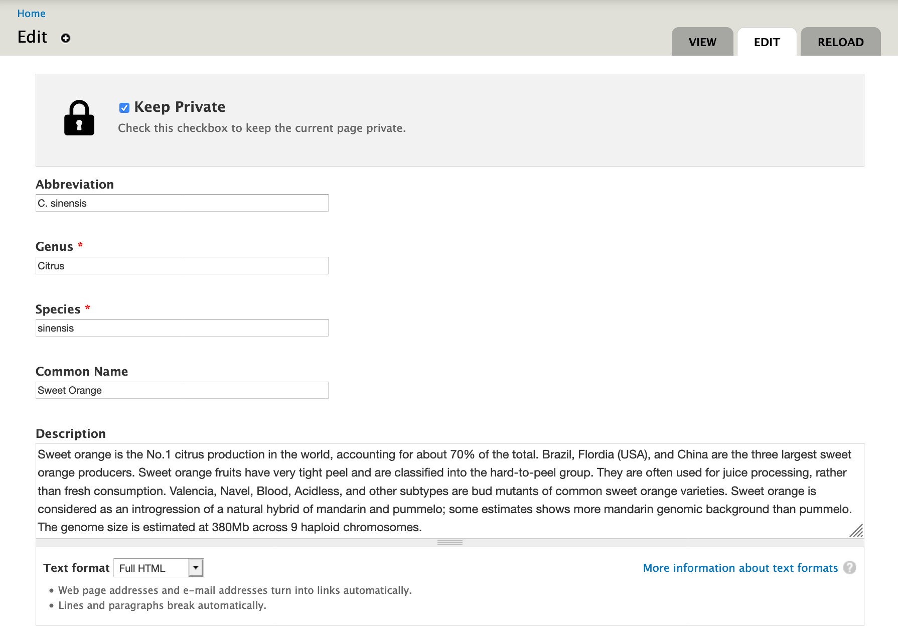
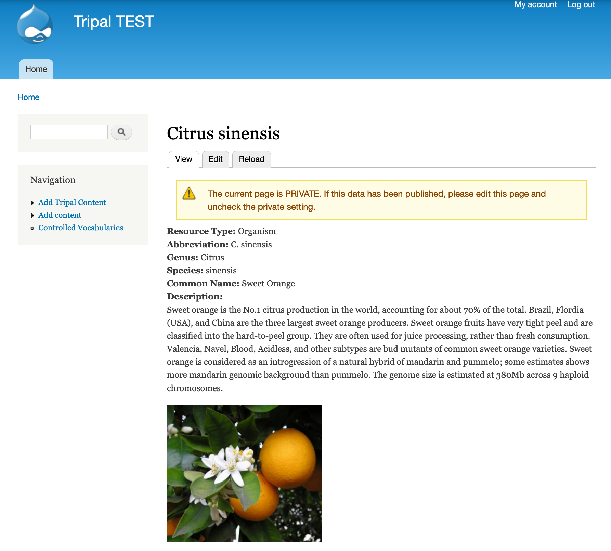
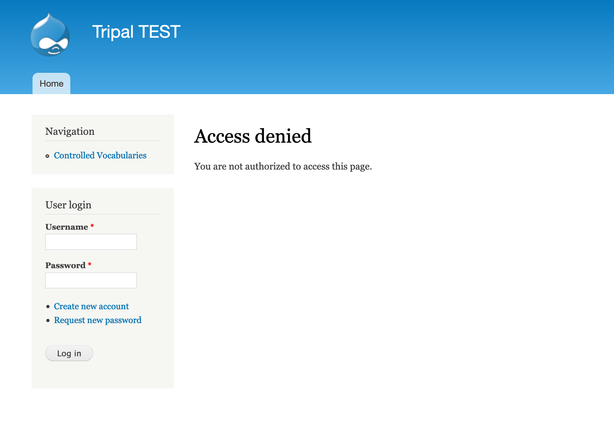

# Private Tripal Content

Do you need a way to keep some data private while other data remains public? Tripal already provides the ability to make some Tripal content types private while others are public (e.g. all genetic maps are private but genes are public) but what if you only want some genetic maps public? This module was made to help in that exact case!

**Make individual pages private while others of the same Tripal Content Type remain public!**

This module provides an additional permission, `[Content type]: View Private Content` for each Tripal Content Type and a TripalField to indicate which exact pages should be private.

Specifically, if you have checked "Keep Private" on a given Tripal Content Page edit form, all users with the `[Content type]: View Private Content` permission will be able to see it and if not, only users with the pre-existing `[Content type]: View Content` will be able to see it. I suggest setting `[Content type]: View Private Content` for authenticated users (or a custom role) and `[Content type]: View Content` for anonymous users.

## Installation

1. Download this repository and unpack it in your `[drupal site]/sites/all/modules` directory.
2. Go to Admin > Modules and enable this module by clicking on the checkbox beside "Private Biodata" and saving the configuration. Alternatively, you can use drush as follows: `drush pm-enable private_biodata`.

**Note: There will be no change in existing permissions when this module is enabled. To make any pages private, follow the usage instructions below.**

## Usage

The following steps show how to make one organism page private:

1. Go to Admin > Structure > Tripal Content Types > Organism > Manage Fields
2. Click "Check for new fields" which should result in a green message saying "Added field: ncit__private" This field will allow you to indicate which pages should be private.
3. Go to Manage Display and make sure the "Keep Private" field is near the top of the page and not disabled.
4. Go to the organism page you want to keep private (e.g. Citrus cinensus from the Tripal Tutorial) and click on edit at the top of the page.
5. Select the checkbox which says "Keep Private" and then save the page. You will now see a note near the top of your page saying the page is private!
6. Go to Admin > People > Permissions and set the "View Private Organism" permission to the role you want to see private pages. Any existing page where you haven't selected "Keep Private" will still have it's original permissions!

**Note: Only pages where you have clicked "Keep Private" will have access changed by this module. All other pages follow the default Tripal core permissions.**

Select Keep Private        |  View Page with Permission  | View Page without Permission
:-------------------------:|:---------------------------:|:-----------------------------:
 |  | 

## Automated Testing

Automated testing for this module was implemented using [Tripal Test Suite]() and is run automatically using Travis CI. You can see the build status above.

## Funding

This work is supported by Saskatchewan Pulse Growers [grant: BRE1516, BRE0601], Western Grains Research Foundation, Genome Canada [grant: 8302, 16302], Government of Saskatchewan [grant: 20150331], and the University of Saskatchewan.

## Citation

Sanderson, L.A. (2020). Private BioData: Protecting biological data until published. Development Version. University of Saskatchewan, Pulse Crop Research Group, Saskatoon, SK, Canada.
